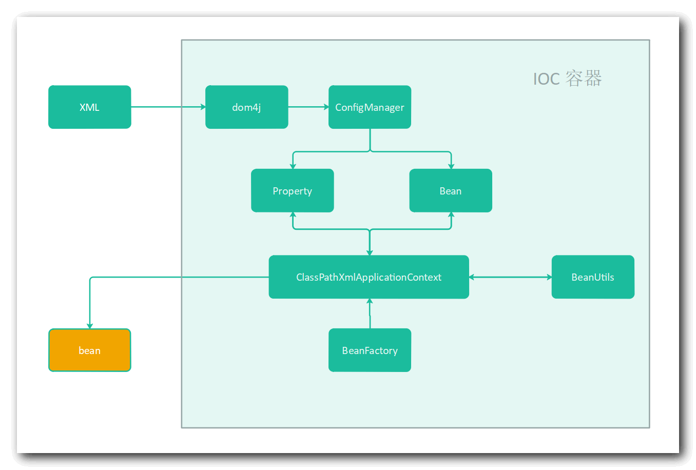
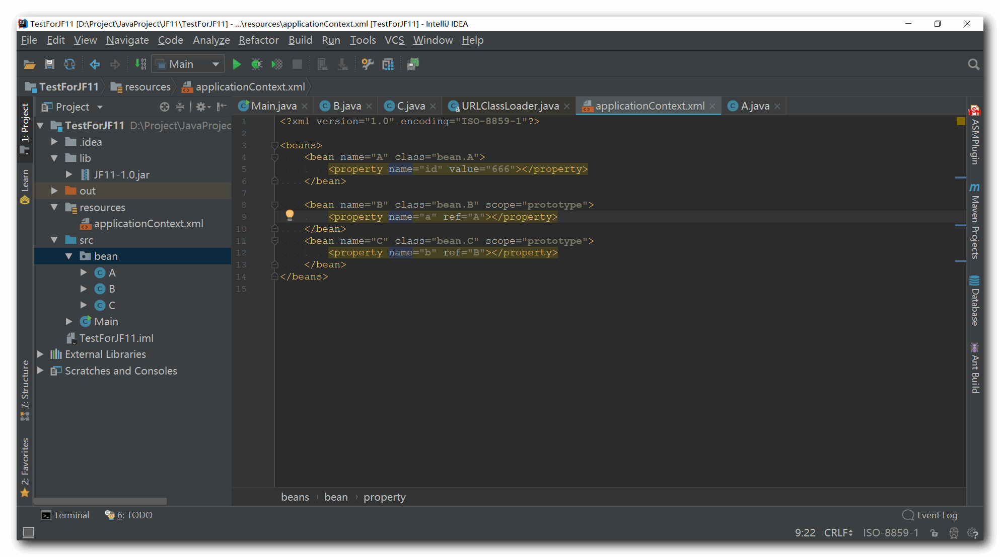
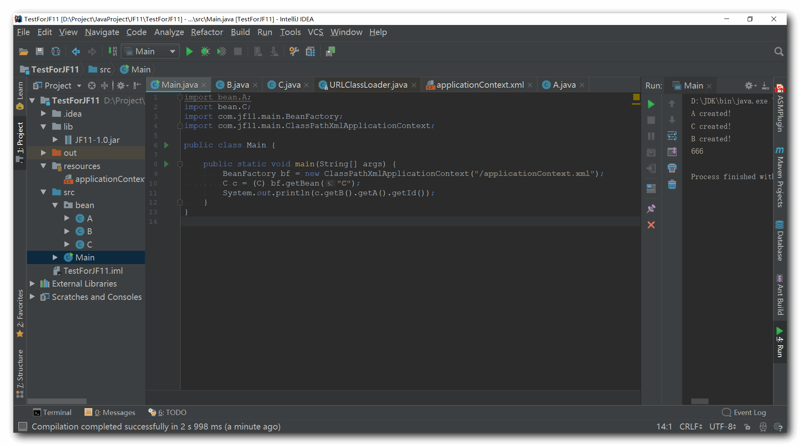

<h1 align="center">JFr11</h1>
>  JFr11（JFree）是一个独立的 Spring IOC 框架，设计实现参考 Spring IOC 容器的模块，起源于大二想学 Spring，但总是觉得麻烦，老是学不会，于是想着要是造出一个 Spring ，那不相当于学会了？不过最后不了了之，今天感觉有点长进了，就翻出以前未完成的小轮子，重新搞一波，完成了这个小轮子

# 功能

IOC 就是获取 Bean 的，干的也基本和 Spring 那套差不多，现在 JFr11 实现了以下功能

- Bean 的值注入与引用注入
- 生命周期管理
- 类型转换

# 用途

如果是不想用 Spring 的其他功能，而是希望只使用 IOC 这个功能来使得代码更加简洁跟精简，就可以用 JFr11 ，对于 Bean 的获取可以不用自己 new 了，通过容器来直接获取，并且提供了 singleton 与 prototype 两种 Bean 的生命周期

# 实现

关于技术，也就以下几个方面：

- dom4j
- Beanutils
- 工厂模式
- 反射

实现原理：

# 使用

小轮子感觉也不需要部署到 Maven 中央仓库，等后期更完善了再考虑部署上去

目前提供第三方 Jar，项目的 REALEASE 即为发布的 Jar

- 导入 Jar 包
- XML 中配置 Bean
- 获取 Bean

